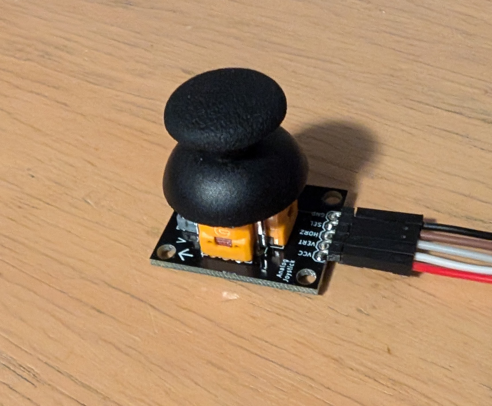
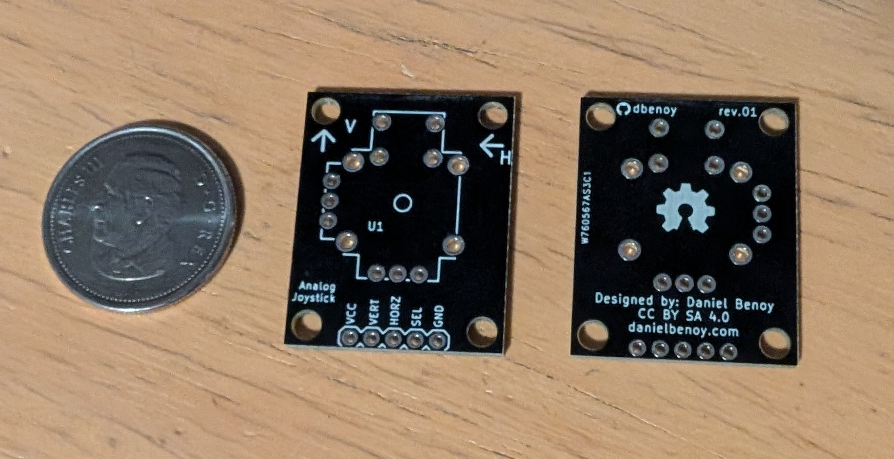
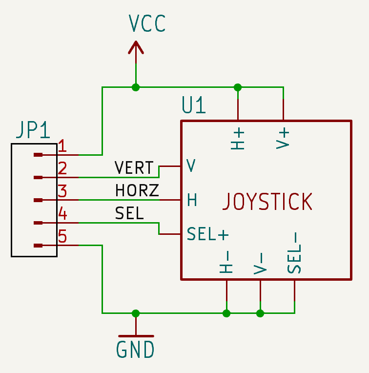
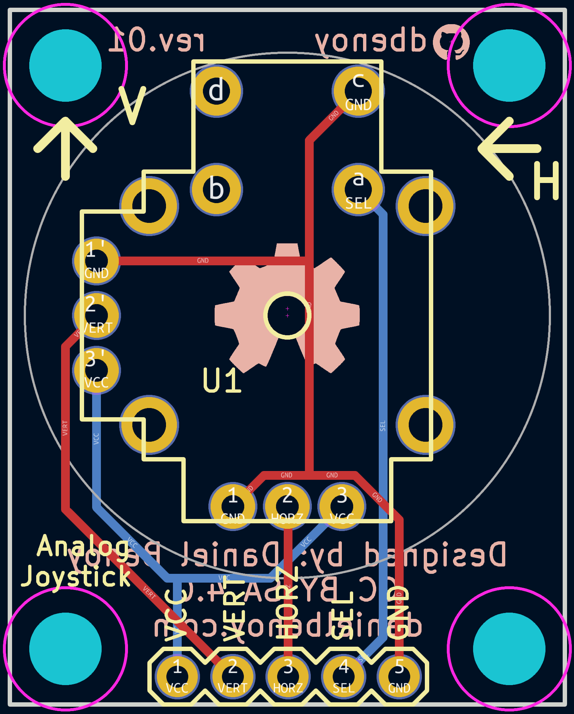

# "PS5 Hall Effect" Compatible Thumbstick Breakout Board
This breakout board is designed to be a drop-in replacement for the Sparkfun BOB-09110 but using hall effect thumbsticks instead of low quality "PS2 style" sticks.

These thumbstick components are widely available on Ali Express as replacement thumbsticks for game controllers. Unlike a traditional potentiometer based joystick, these sticks only operate with a specific polarity, so ensure you select one meant specifically for the PS5 to match the design of this board.

PCBWay order link: 
https://www.pcbway.com/project/shareproject/_PS5_Hall_Effect_Thumbstick_Breakout_Board_abc13f47.html 
(10 for $5 at time of writing. I get a small commission.)

 

 

## Datasheet
I couldn't find a datasheet for these stick components, but the datasheet for [this alternative](https://mm.digikey.com/Volume0/opasdata/d220001/medias/docus/2608/THB001P%20drawing.pdf) stick seemed to have measurement information the exact same footprint, so it was used in the creation of this board.

## License
Copyright (c) Daniel Benoy

Distributed under the terms of the [Creative Commons ShareAlike 4.0 International](https://creativecommons.org/licenses/by-sa/4.0/) license.

THESE FILES ARE PROVIDED BY THE COPYRIGHT HOLDERS AND CONTRIBUTORS “AS IS” AND ANY EXPRESS OR IMPLIED WARRANTIES, INCLUDING, BUT NOT LIMITED TO, THE IMPLIED WARRANTIES OF MERCHANTABILITY AND FITNESS FOR A PARTICULAR PURPOSE ARE DISCLAIMED. IN NO EVENT SHALL THE COPYRIGHT OWNER OR CONTRIBUTORS BE LIABLE FOR ANY DIRECT, INDIRECT, INCIDENTAL, SPECIAL, EXEMPLARY, OR CONSEQUENTIAL DAMAGES (INCLUDING, BUT NOT LIMITED TO, PROCUREMENT OF SUBSTITUTE GOODS OR SERVICES; LOSS OF USE, DATA, OR PROFITS; OR BUSINESS INTERRUPTION) HOWEVER CAUSED AND ON ANY THEORY OF LIABILITY, WHETHER IN CONTRACT, STRICT LIABILITY, OR TORT (INCLUDING NEGLIGENCE OR OTHERWISE) ARISING IN ANY WAY OUT OF THE USE OF THIS SOFTWARE, EVEN IF ADVISED OF THE POSSIBILITY OF SUCH DAMAGE.
